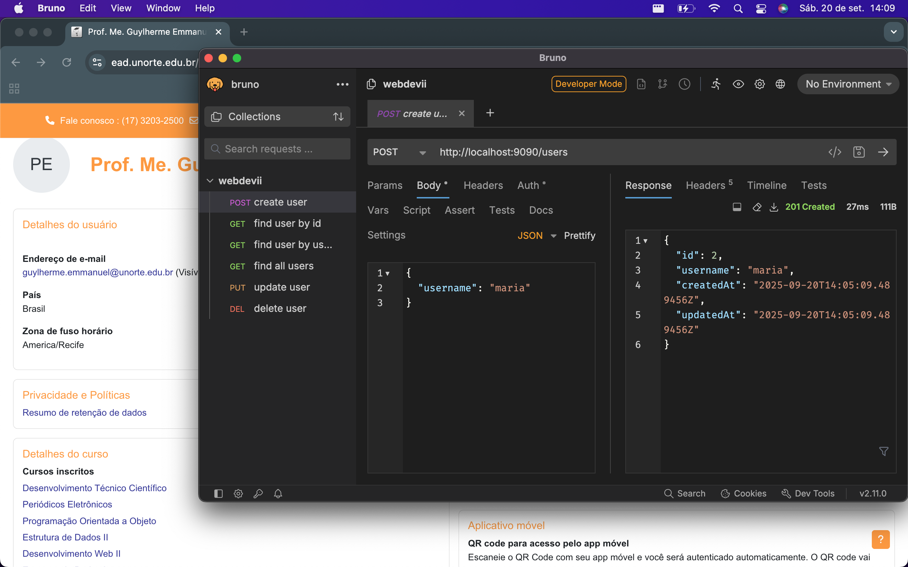

# Roteiro de Atividade

Utilizando Postman/Insomnia/Bruno você deve gerar um relatório baseado no seguinte [modelo](https://docs.google.com/document/d/1dZJO-k1eYrsXfP3zzGkHdUdqM-zal_CIBQ5HPjtOE30/edit?usp=sharing), com prints de tela das execuções específicadas abaixo.

- _IMPORTANTE:_ O print deve mostrar ao fundo seu usuário logado no AVA e data e hora de seu computador, conforme exemplo abaixo:



## POST

1. Criar um usuário com o username `jose`
2. Criar um usuário com o username `maria`
3. Criar um usuário com o username `jose`
4. Criar um usuário com o username `nulo`

### Saídas esperadas POST

1. Status code: 201

   ```json
   {
     "id": 1,
     "username": "jose",
     "createdAt": "2025-09-20T13:18:14.315401Z",
     "updatedAt": "2025-09-20T13:18:14.315401Z"
   }
   ```

2. Status code: 201

   ```json
   {
     "id": 2,
     "username": "maria",
     "createdAt": "2025-09-20T13:18:14.315401Z",
     "updatedAt": "2025-09-20T13:18:14.315401Z"
   }
   ```

3. Status code: 400

   ```json
   {
     "status": "BAD_REQUEST",
     "errorMessage": "Usuário com username: jose já existe"
   }
   ```

4. Status code: 400

   ```json
   {
     "status": "BAD_REQUEST",
     "errorMessage": "username é obrigatório"
   }
   ```

## GET

1. Buscar pelo usuário de id = `1`
2. Buscar pelo usuário de username = `maria`
3. Buscar pelo usuário de id = `10`
4. Buscar pelo usuário de username = `janete`
5. Trazer a lista de todos os usuários

### Saídas esperadas GET

1. Status code: 200

   ```json
   {
     "id": 1,
     "username": "jose",
     "createdAt": "2025-09-20T13:18:14.315401Z",
     "updatedAt": "2025-09-20T13:18:14.315401Z"
   }
   ```

2. Status code: 200

   ```json
   {
     "id": 2,
     "username": "maria",
     "createdAt": "2025-09-20T13:18:14.315401Z",
     "updatedAt": "2025-09-20T13:18:14.315401Z"
   }
   ```

3. Status code: 404

   ```json
   {
     "status": "NOT_FOUND",
     "errorMessage": "usuário com id: 10 não encontrado"
   }
   ```

4. Status code: 400

   ```json
   {
     "status": "NOT_FOUND",
     "errorMessage": "usuário com username: janete não encontrado"
   }
   ```

5. Status code: 200

   ```json
   [
     {
       "id": 1,
       "username": "jose",
       "createdAt": "2025-09-20T13:49:50.594304Z",
       "updatedAt": "2025-09-20T13:49:50.594304Z"
     },
     {
       "id": 2,
       "username": "maria",
       "createdAt": "2025-09-20T13:49:55.582836Z",
       "updatedAt": "2025-09-20T13:49:55.582836Z"
     }
   ]
   ```

## PUT

1. Atualizar o usuário de id = `1` para possuir o username `pedro`
2. Atualizar o usuário de id = `10` para possuir o username `janete`

### Saídas esperadas PUT

1. Status code: 200

   ```json
   {
     "id": 1,
     "username": "pedro",
     "createdAt": "2025-09-20T13:49:50.594304Z",
     "updatedAt": "2025-09-20T13:59:16.572954Z"
   }
   ```

2. Status code: 404

   ```json
   {
     "status": "NOT_FOUND",
     "errorMessage": "usuário não encontrado"
   }
   ```

## DELETE

1. Deletar o usuário de id = `1`
2. Deletar o usuário de id = `10`

### Saídas esperadas DELETE

1. Status code: 204

2. Status code: 404

   ```json
   {
     "status": "NOT_FOUND",
     "errorMessage": "usuário não encontrado"
   }
   ```
